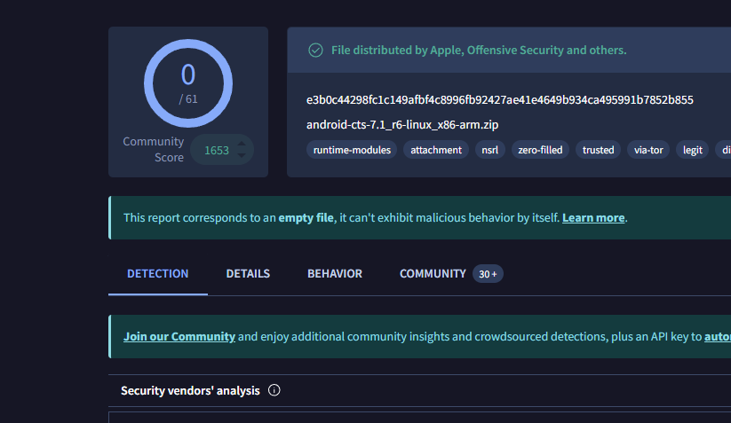

# Razor - Roblox Executor

Welcome to the **Razor** GitHub repository! Razor is a Roblox executor created for educational purposes only. We do not condone any use of this tool that violates the Roblox Terms of Service (ToS). Please use this repository responsibly.

## Disclaimer

**Razor** is intended **solely for educational purposes**, and we do not condone or encourage the misuse of this tool. Use it at your own discretion, and please adhere to all applicable terms and conditions set forth by Roblox.

## Features

- **Public Script Access**: Our Discord community has a section where users can freely share and access public scripts.
- **Trusted Code**: Scripts verified and trusted by me are marked as such, allowing you to use them with more confidence.

## Installation

To get started with Razor, follow these steps:

1. **Download**: Download the ZIP file of this repository.
2. **Extract**: Extract the ZIP file and place the contents in a dedicated folder.
3. **Load**: Open the folder and run the **bootstrapper** to launch the executor.

## Community and Support

Join our **Discord** community to access scripts, ask questions, and get support from other users. Our community is committed to sharing knowledge responsibly, and we encourage safe and ethical use.
**Discord:** https://discord.gg/tK4TuegB67
## Screenshot

## BoringNess
I know this executor and the community is dry but you can bring it to life. if you can do anything for this community I would Be proud.🥺

## Support
IF you could bring this community to life I would Be thankful

> **Reminder**: Use of this tool outside of its intended, educational purposes may lead to consequences. Please use it responsibly.
